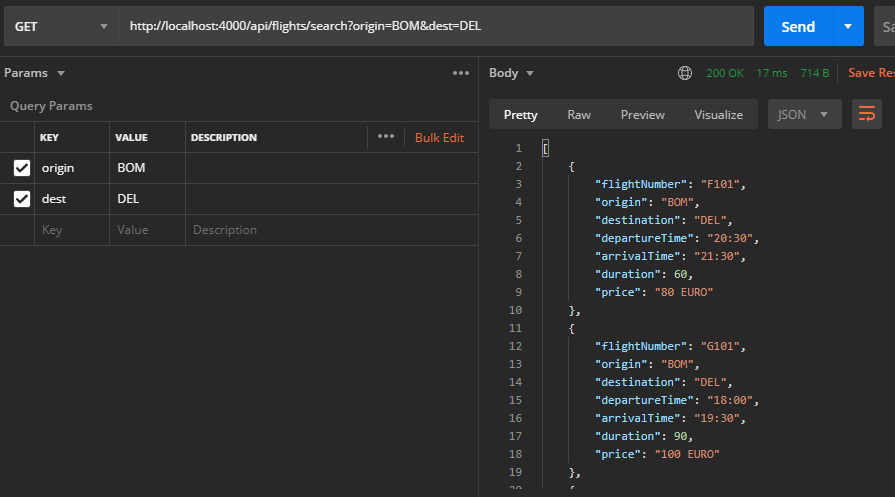
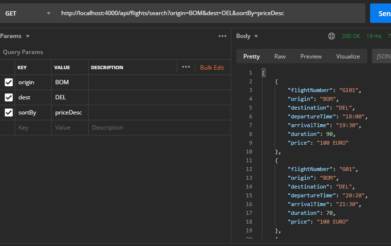
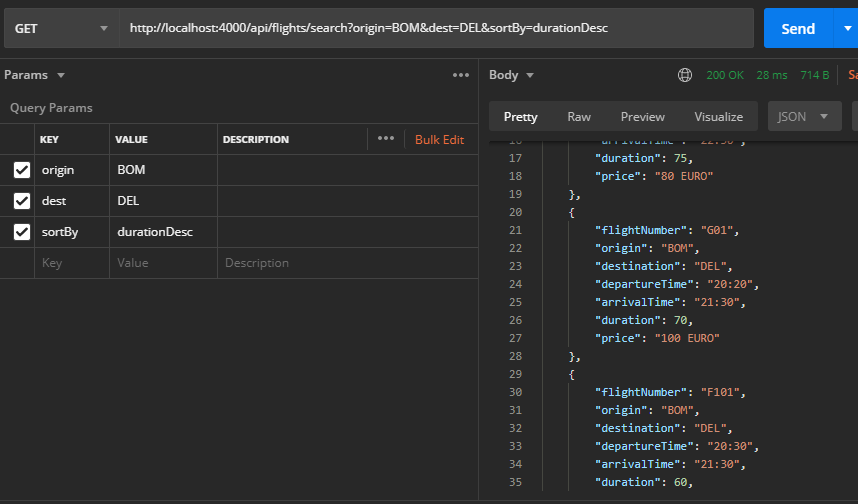
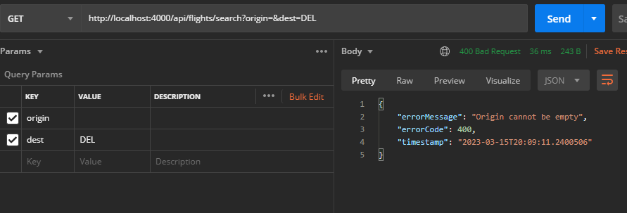
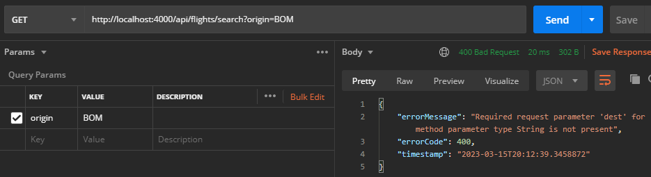
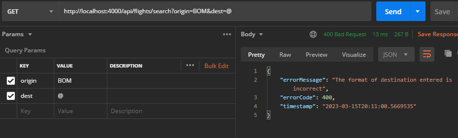
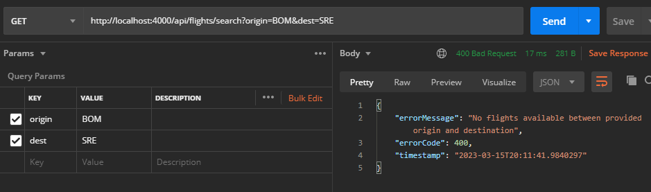
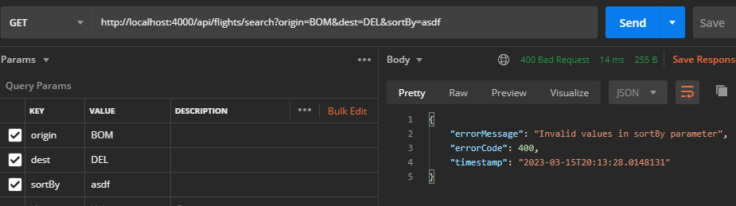

# anb-assignment

This application exposes an API to search flights between supplied origin and destination.

Optionally, sortBy parameter can also be supplied in the API to sort the results. Details in following section.

Note: When FlightSearchApplication.java (com/assignment/flightsearch/FlightSearchApplication.java) is first run, it loads the data from flightdata.csv (in resources) into H2 database. The relevant code is in DataLoader class (src/main/java/com/assignment/flightsearch/dataloader/DataLoader.java)

## API Details
GET /api/flights/search?origin=BOM&dest=DEL&sortBy=priceAsc

origin and dest params are mandatory in the request. If not provided, relevant error is thrown

sortBy is an optional parameter. It can have these values: priceAsc, priceDesc, durationAsc, durationDesc. Any other value will give an error

The API return a list of flights between supplied origin and destination.

### Screenshots:

1. When correct origin and destination is provided :

   
2. When correct origin, destination and sortBy is provided (sorting on price field):

   
3. When correct origin, destination and sortBy is provided (sorting on duration field):

   
4. When incorrect origin is provided (empty origin):

   
5. When dest is not passed in request params :

   
6. When invalid value is passed in dest :

   
7. When no flights are available between supplied origin and dest:

   
8. When invalid values are given in sortBy:

   
